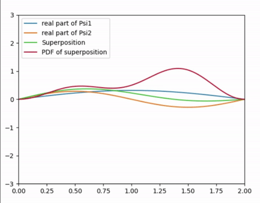

# Schrödinger Equation Demo

  

### Overview
In this project, we use Python to plot and animate the analytical and numerical solutions to the Schrödinger equation, and show how the toy qunatum mechanics problem of a 
particle in a box evolves with time! 

### The Schrödinger Equation

The Schrödinger equation is a partial differential equation that describes how the wavefunction of a physical system evolves over time, that is, it predicts probability at a 
quantum scale. It is the fundamental equation of physics for describing quantum mechanical behavior. It is used to find the allowed energy levels of quantum mechanical systems
(such as atoms, or transistors). The associated wavefunction gives the probability of finding the particle at a certain position. 
